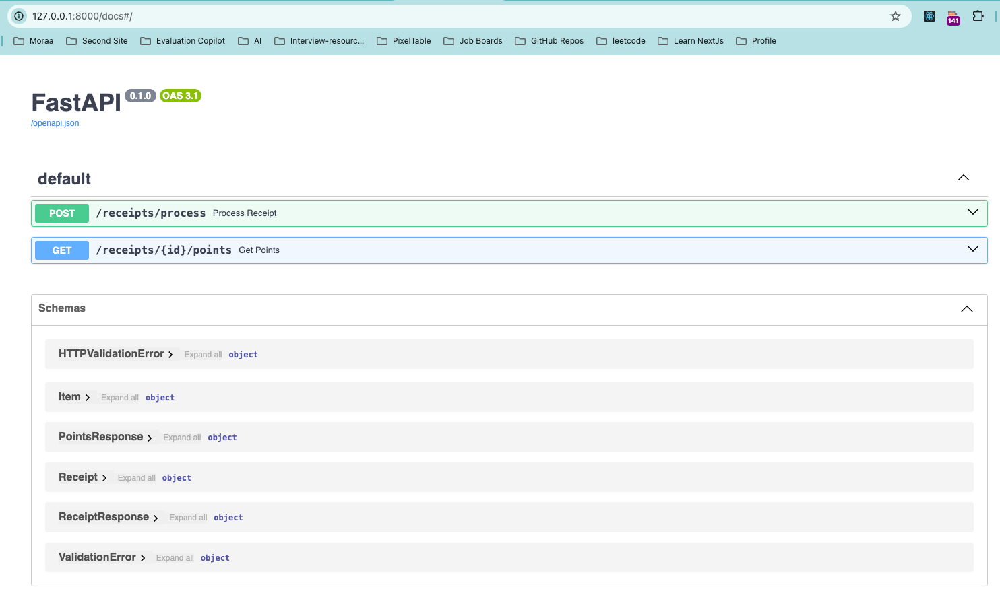
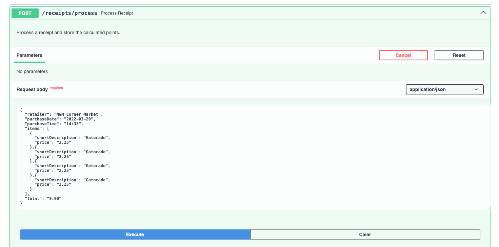
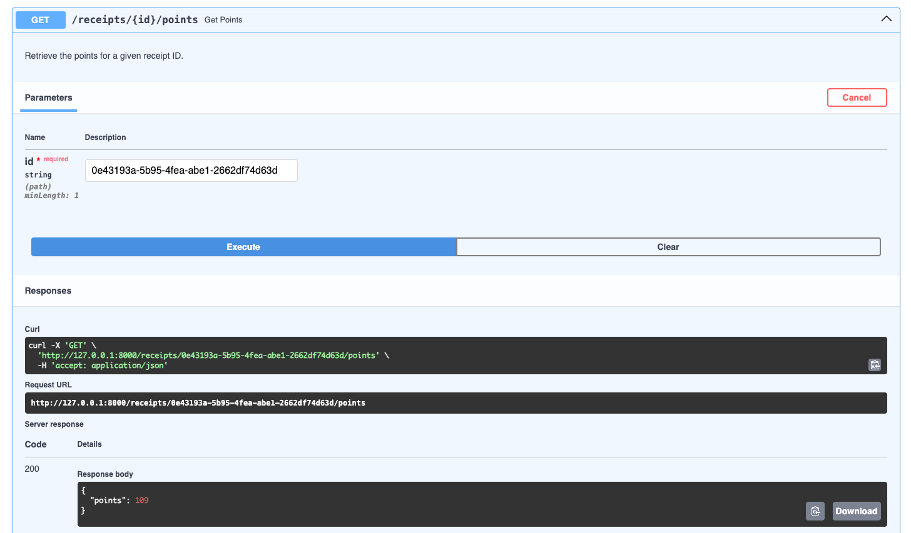

# Receipt Processor API

A simple API for processing receipts and awarding points based on specific rules.

## Steps to Run the App

### 1. Setup a Virtual Environment

First, create and activate a virtual environment:

```sh
python -m venv venv
source venv/bin/activate  # On Windows use `venv\Scripts\activate`
```

### 2. Install Dependencies

Install the required dependencies using the `requirements.txt` file:

```sh
pip install -r requirements.txt
```

### 3. Run the App

Start the FastAPI application using Uvicorn:

```sh
fastapi dev main.py
```

### 4. Using `/docs`

Once the app is running, you can access the interactive API documentation provided by Swagger UI at:

```
http://127.0.0.1:8000/docs
```


## How to Run Tests

To run the tests, use the `pytest` framework. Ensure your virtual environment is activated and run:

```sh
pytest test_main.py
```

This will execute all the tests and provide a summary of the results.

## Pydantic Data Models

### Receipt

The `Receipt` model represents the structure of a receipt that needs to be processed. It includes the following fields:

- **retailer**: The name of the retailer or store the receipt is from. (string)
- **purchaseDate**: The date of the purchase printed on the receipt. (date in `YYYY-MM-DD` format)
- **purchaseTime**: The time of the purchase printed on the receipt. (time in `HH:MM` format)
- **items**: A list of items on the receipt. Each item includes:
  - **shortDescription**: The short product description for the item. (string)
  - **price**: The total price paid for this item. (decimal with two places)
- **total**: The total amount paid on the receipt. (decimal with two places)

### Item

The `Item` model represents an individual item on the receipt. It includes the following fields:

- **shortDescription**: The short product description for the item. (string)
- **price**: The total price paid for this item. (decimal with two places)

### Example Receipt

```json
{
  "retailer": "Target",
  "purchaseDate": "2022-01-01",
  "purchaseTime": "13:01",
  "items": [
    {
      "shortDescription": "Mountain Dew 12PK",
      "price": "6.49"
    },
    {
      "shortDescription": "Emils Cheese Pizza",
      "price": "12.25"
    },
    {
      "shortDescription": "Knorr Creamy Chicken",
      "price": "1.26"
    },
    {
      "shortDescription": "Doritos Nacho Cheese",
      "price": "3.35"
    },
    {
      "shortDescription": "Klarbrunn 12-PK 12 FL OZ",
      "price": "12.00"
    }
  ],
  "total": "35.35"
}
```

### Example Response

```json
{
  "id": "7fb1377b-b223-49d9-a31a-5a02701dd310"
}
```

### Points Calculation Rules

The points awarded to a receipt are calculated based on the following rules:

1. One point for every alphanumeric character in the retailer name.
2. 50 points if the total is a round dollar amount with no cents.
3. 25 points if the total is a multiple of `0.25`.
4. 5 points for every two items on the receipt.
5. If the trimmed length of the item description is a multiple of 3, multiply the price by `0.2` and round up to the nearest integer. The result is the number of points earned.
6. 6 points if the day in the purchase date is odd.
7. 10 points if the time of purchase is after 2:00pm and before 4:00pm.

## Endpoints

### Process Receipts

- **Path**: `/receipts/process`
- **Method**: `POST`
- **Payload**: Receipt JSON
- **Response**: JSON containing an ID for the receipt.



### Get Points

- **Path**: `/receipts/{id}/points`
- **Method**: `GET`
- **Response**: JSON object containing the number of points awarded.

Example Response:

```json
{
  "points": 32
}
```



---